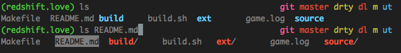

Dotfiles
========

My config files for VIM and ZSH

Screenies!
--------
_VIM_

 

_ZSH_ 

Dependencies
-----
*.vimrc*
- [Vundle](http://www.vim.org/scripts/script.php?script_id=3458)
- Then open the .vimrc file and run `:BundleInstall` to get the rest of the plugins.

*.zshrc*
- [oh-my-zsh](https://github.com/robbyrussell/oh-my-zsh)
- Put the `mine` theme in `~/.oh-my-zsh/themes`

Features in my .vimrc
----
- A bunch of awesome plugins:
  - [Vundle](http://www.vim.org/scripts/script.php?script_id=3458)
  - [SuperTab](http://www.vim.org/scripts/script.php?script_id=182)
  - [CtrlP](https://github.com/kien/ctrlp.vim)
  - [NerdTree](http://www.vim.org/scripts/script.php?script_id=1658)
  - [minibufexpl.vim](https://github.com/fholgado/minibufexpl.vim)
  - [Vim Markdown](https://github.com/plasticboy/vim-markdown)
  - [NerdCommenter](http://www.vim.org/scripts/script.php?script_id=1218)
  - [delimitMate](http://www.vim.org/scripts/script.php?script_id=2754)
  - [vim-taglist](http://www.vim.org/scripts/script.php?script_id=273)
  - [SearchComplete](http://www.vim.org/scripts/script.php?script_id=474)
- Leader is mapped to `,`
- NerdTree can be toggled on and off with `,n`
- TagList can be toggled on and off with `,t`
- Makes project with `,m`

Features in my .zshrc
---
- Fixes some of the slowness of zsh autocomplete
- `finder` alias opens current directory in finder
- `tn` alias will open a terminal notification with the message in the following quotes
- `syssleep` will send compter to sleep with simple applescript
- `mine` theme is a simple theme (with only ASCII characters because I don't like having unicode symbols all over the place)
