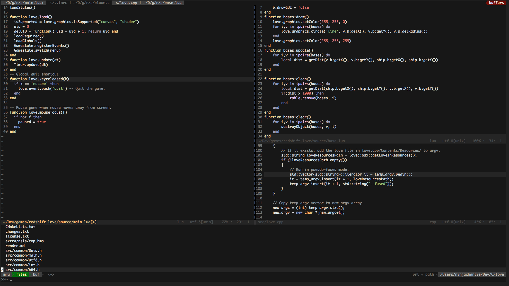
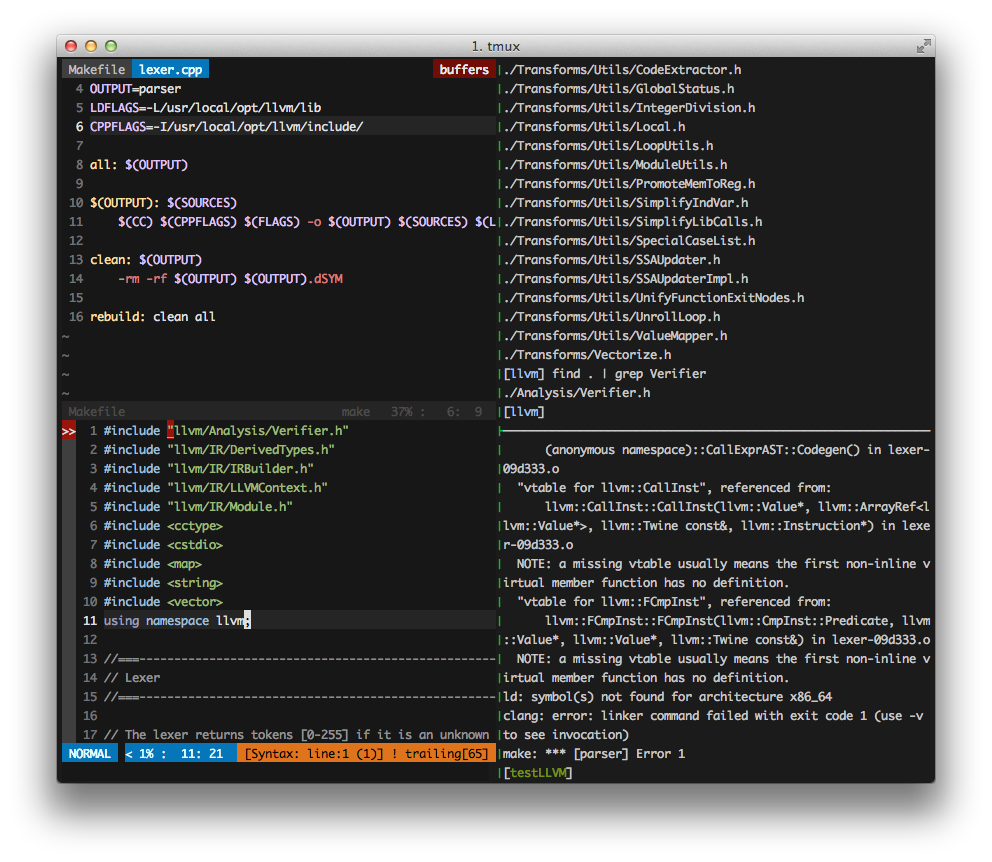

Dotfiles
========
My config files for Vim and tmux

Screenies!
--------
_Vim_ 

 

_tmux/Vim/zsh_ 

Dependencies
-----
*.vimrc*
- [Vundle](http://www.vim.org/scripts/script.php?script_id=3458)
- Then open the .vimrc file and run `:PluginInstall` to get the rest of the plugins.

Features and overview of .vimrc
----
- Minimal cruft. As few plugins as possible (features are instead implemented in vimrc). This limits the number of odd dependency issues, and opens up the vimrc to more configuration.
- Plugins enabled and configured:
  - [Vundle](http://www.vim.org/scripts/script.php?script_id=3458)
  - [Taglist](http://www.vim.org/scripts/script.php%3Fscript_id%3D273)
  - [Vim Fugitive](https://github.com/tpope/vim-fugitive)
  - [Syntastic](https://github.com/scrooloose/syntastic)
  - [Rainbow Parentheses](https://github.com/kien/rainbow_parentheses.vim)
  - [Scratch.vim](https://github.com/mtth/stratch.vim)
- Ctrl-P-like file searching using dmenu. Much faster and lighter weight. (If Dmenu isn't avaliable, defaults back to ctrl-p)
- Leader is mapped to `,`
- Switch between C/C++ source files and header files using `,a`

------
Features in my .tmux.conf
---
- Ctrl-Space leader (Better than Ctrl-B.)
- Sensible defaults
- Vim movement
- Hidden status bar by default
