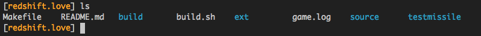

Dotfiles
========
My config files for Vim and bash

Screenies!
--------
_Vim_ 

 

_bash_ 

Dependencies
-----
*.vimrc*
- [Vundle](http://www.vim.org/scripts/script.php?script_id=3458)
- Then open the .vimrc file and run `:PluginInstall` to get the rest of the plugins.

Features in my .vimrc
----
- A bunch of awesome plugins:
  - [Vundle](http://www.vim.org/scripts/script.php?script_id=3458)
  - [CtrlP](https://github.com/kien/ctrlp.vim)
  - [NerdTree](https://github.com/scrooloose/nerdtree)
  - [GitGutter](https://github.com/airblade/vim-gitgutter)
  - [YouCompleteMe](https://github.com/Valloric/YouCompleteMe)
  - [Vim Dispatch](https://github.com/tpope/vim-dispatch)
  - [Vim Markdown](https://github.com/plasticboy/vim-markdown)
  - [delimitMate](http://www.vim.org/scripts/script.php?script_id=2754)
  - [SearchComplete](http://www.vim.org/scripts/script.php?script_id=474)
  - [Vim Airline](https://github.com/bling/vim-airline)
- Leader is mapped to `,`
- `make` project with `,m`
- `,f` fuzzy searches functions in the file.
- `,/` fuzzy searches text in the file
- `,t` pops open NerdTree

Features in my .bash_profile
---
- Optimized for OS X
- Random prompt color (makes differentiation between prompts easier)
- Git aliases (`g` = `git`, `ga` = `git add`, `gc` = `git commit`, etc.)
- `v` for vim and `vim` for gvim
- Autojump
- `finder` alias opens current directory in finder
- `syssleep` will send computer to sleep with simple applescript
