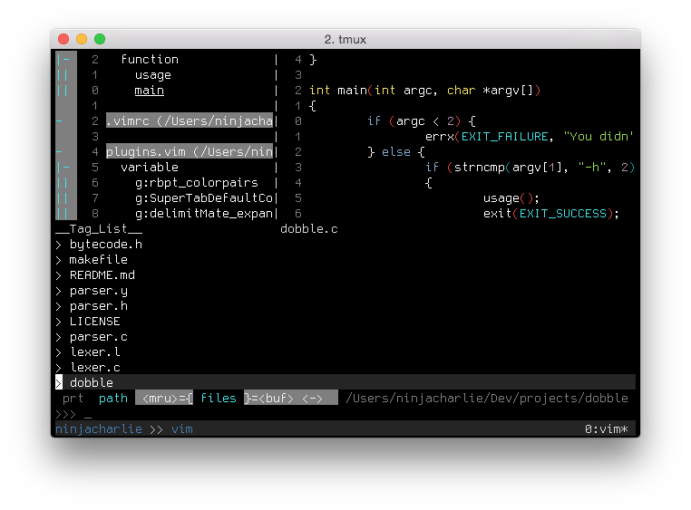
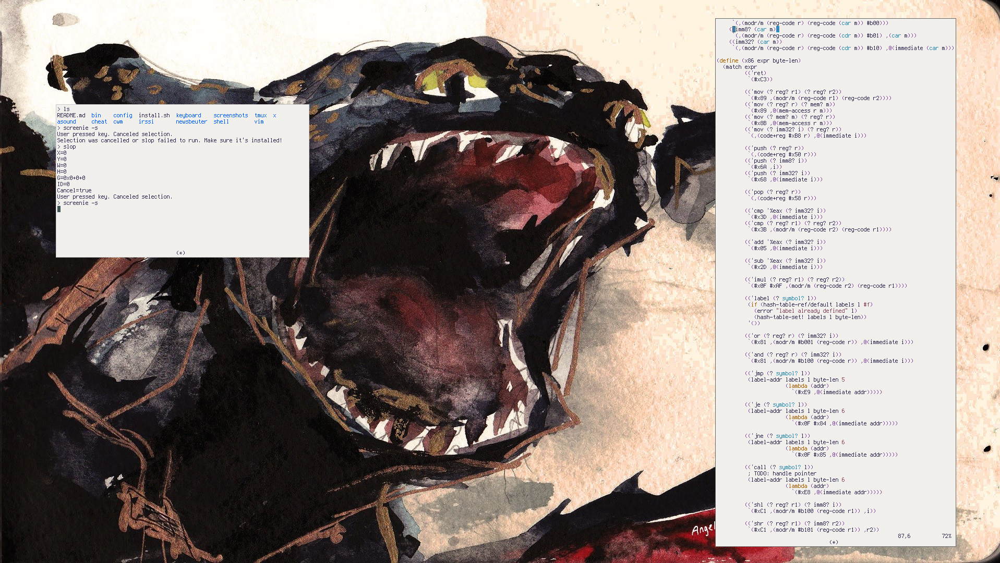

Dotfiles
========
My config files.

Screenies!
--------
_Vim_ 

 

_tmux/Vim/mksh_ 

Install
----
`git clone https://github.com/charles-l/dotfiles ~/.dotfiles`  
`sh ~/.dotfiles/install.sh`

Features and overview of .vimrc
----
- Minimal cruft.
- Lots 'o plugins configured and ready to go ([See for yourself](./vim/plugins.vim))
- Leader is mapped to `,`
- Switch between C/C++ source files and header files using `,a`

------
Features in my .tmux.conf
---
- Ctrl-Space leader (Better than Ctrl-B.)
- Sensible defaults
- Vim movement
- Hidden status bar by default

-----
Shell
----

Shell configuration is POSIX complient and will work in most shells. I personally prefer mksh ('cause it's lightweight and has many of the useful features of bash)

------
File Layout
------
`git/` Git configuration (`.gitignore_global`)

`shell/` Generic shell configuration (POSIX complient variables, functions, aliases)

`tmux/` Tmux configuration (`.tmux.conf`)

`zsh/` Zsh and zprezto specific config (`.zshrc`, `.zpreztorc`)

`vim/` Vim config (split out for plugins, global configuration, etc.)
