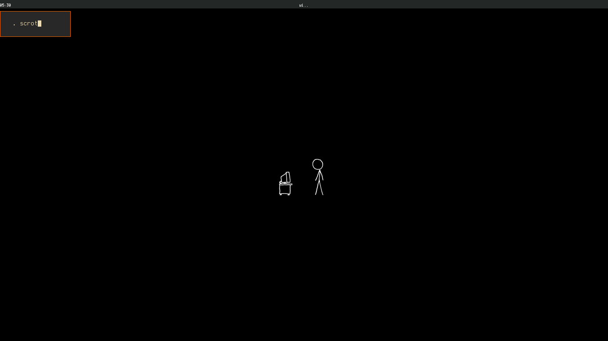
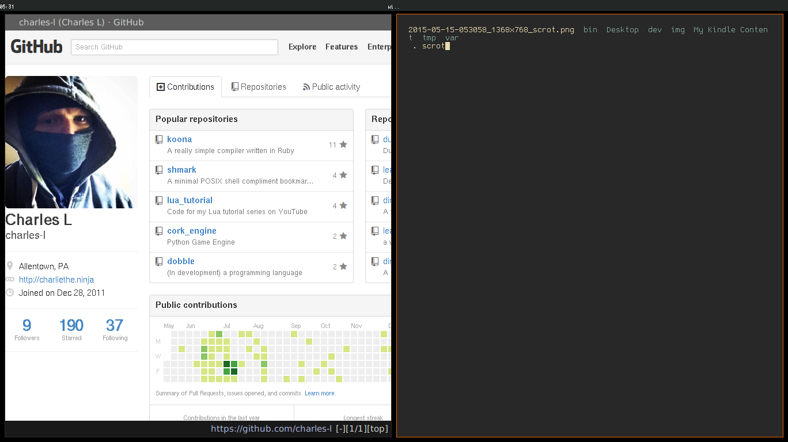

Dotfiles
========
My config files.

Screenies!
--------
Clean 

 

(fake) Busy 

Install
----
`git clone https://github.com/charles-l/dotfiles ~/.dotfiles`  
`sh ~/.dotfiles/install.sh`
Currently, it's not installing the linux specific stuff (bspwm, xorg, etc), in case you're on OS X.

-----
Shell
----

Shell configuration is POSIX complient and will work in most shells. I personally prefer mksh ('cause it's lightweight and has many of the useful features of bash)
