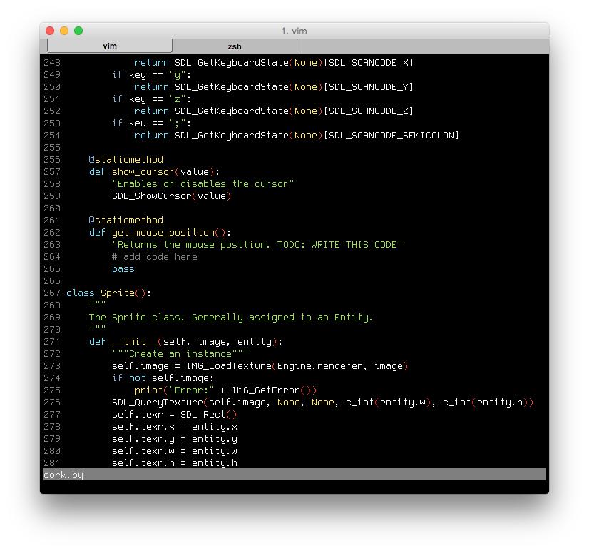

Dotfiles
========
My config files for Vim and bash

Screenies!
--------
_Vim_ 

 

_bash_ 

_tmux/Vim/bash_ 

Dependencies
-----
*.vimrc*
- [Vundle](http://www.vim.org/scripts/script.php?script_id=3458)
- Then open the .vimrc file and run `:PluginInstall` to get the rest of the plugins.

Features in my .vimrc
----
- A bunch of awesome plugins, enabled and configured:
  - [Vundle](http://www.vim.org/scripts/script.php?script_id=3458)
  - [CtrlP](https://github.com/kien/ctrlp.vim)
  - [NerdTree](https://github.com/scrooloose/nerdtree)
  - [Taglist](http://www.vim.org/scripts/script.php%3Fscript_id%3D273)
  - [YouCompleteMe](https://github.com/Valloric/YouCompleteMe)
  - [Vim Dispatch](https://github.com/tpope/vim-dispatch)
  - [Vim Markdown](https://github.com/plasticboy/vim-markdown)
  - [delimitMate](http://www.vim.org/scripts/script.php?script_id=2754)
  - [SearchComplete](http://www.vim.org/scripts/script.php?script_id=474)
  - [Vim Airline](https://github.com/bling/vim-airline)
  - [Vim Surround](https://github.com/tpope/vim-surround)
  - [Vim Endwise](https://github.com/tpope/vim-endwise)
  - [Vim Fugitive](https://github.com/tpope/vim-fugitive)
  - [Vim Obsession](https://github.com/tpope/vim-obsession)
  - [Vim-Tmux navigator](https://github.com/christoomey/vim-tmux-navigator)
  - [Slimux](https://github.com/epeli/slimux)
  - [Syntastic](https://github.com/scrooloose/syntastic)
  - [AutoTag](http://www.vim.org/scripts/script.php?script_id=1343)
  - [OmniCppComplete](http://www.vim.org/scripts/script.php?script_id=1520)
  - [buffkill](http://www.vim.org/scripts/script.php?script_id=1147)
- Leader is mapped to `,`
- `make` project with `,m` (uses `Make` wrapper from dispatch, so you get smarter builds)
- `,f` fuzzy searches functions in the file.
- `,/` fuzzy searches text in the file
- `,t` pops open NerdTree
- `,T` pops open Tag list
- Decent omni-complete configuration. I'm still trying to optimize it, but it should work in most situations.

Features in my .bash_profile
---
- Optimized for OS X
- Random prompt color (makes differentiation between prompts easier)
- Git aliases (`g` = `git`, `ga` = `git add`, `gc` = `git commit`, etc.)

Features in my .tmux.conf
---
- Sensible defaults
- Vim movement
- Vim/tmux pane integration (C-h, C-j, C-k, C-l, will move left, down, right and left between Vim/Tmux panes)
- OS X clipboard configuration (shouldn't be too hard to modify for linux, though.)
